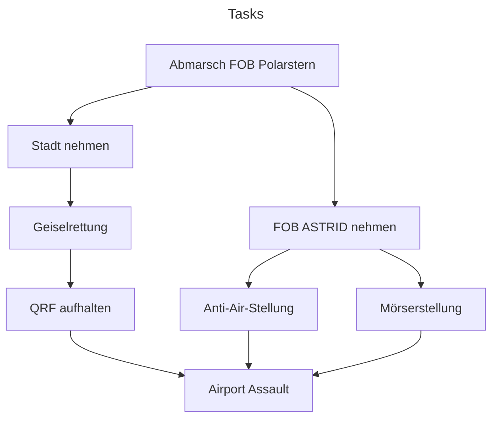

```mermaid
---
title: Tasks
---
flowchart TB

A[Abmarsch FOB Polarstern] --> B[FOB ASTRID nehmen]
A --> C[Stadt nehmen] --> F[Geiselrettung] --> G[QRF aufhalten] --> H
B --> D[Anti-Air-Stellung] --> H[Airport Assault]
B --> E[Mörserstellung] --> H
```

```mermaid
gantt
	title Timeline
	dateFormat HH:mm
	axisFormat %H %M
	
	section Fox
	Stadt nehmen :a1, 20:00, 21:00
	Geiselrettung :a2, after a1, 22:00
	Airport nehmen :a3, after a2, 23:00

	section Victor
	FOB ASTRID nehmen :b1, 20:00, 21:00
	Anti-Air-Stellung :b2, after b1, 22:00
	Möserstellung :b3, after b1, 22:00
	Airport nehmen :a3, after a2, 23:00
```
